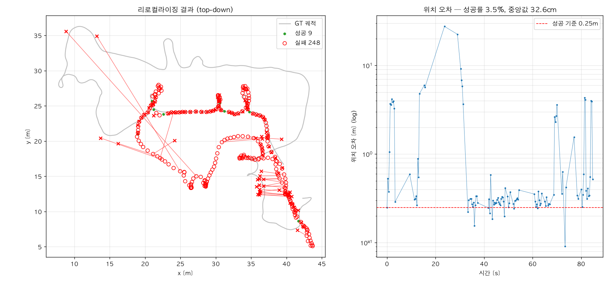
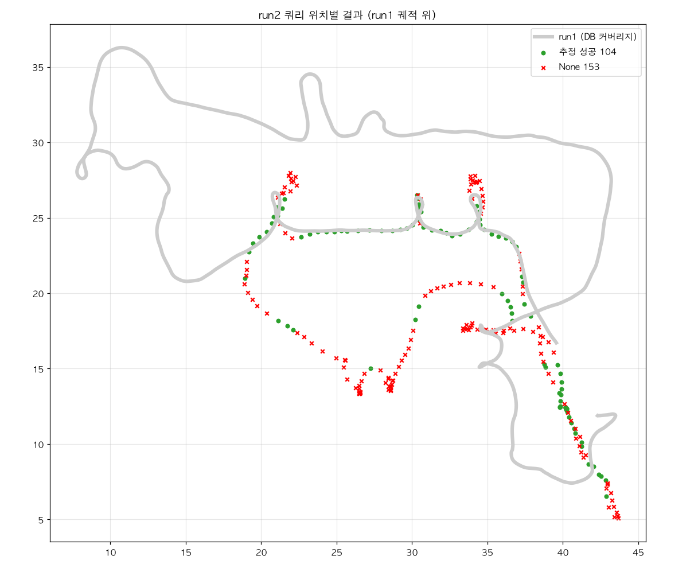
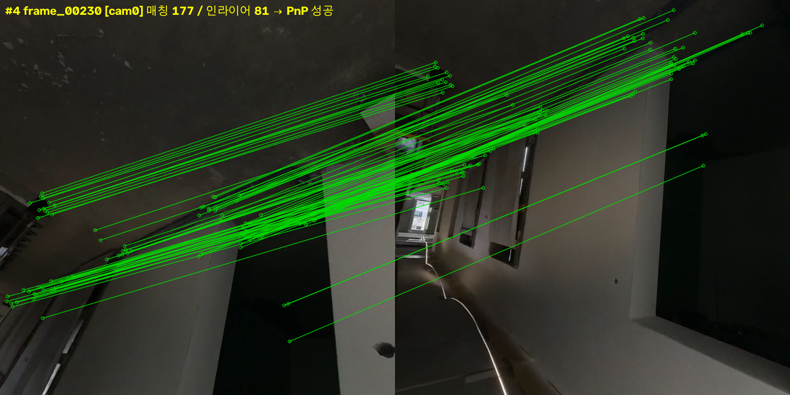
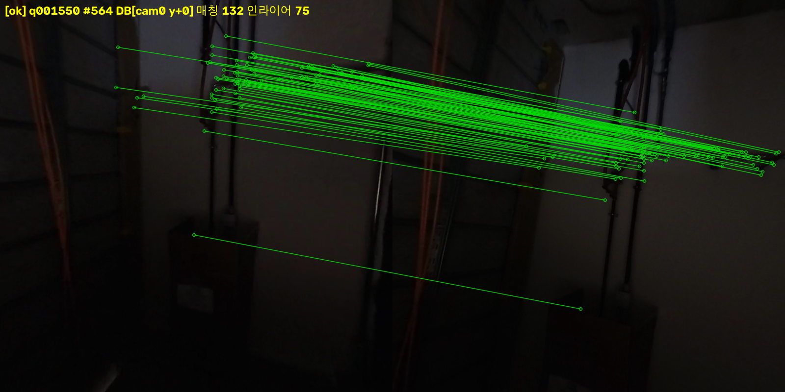
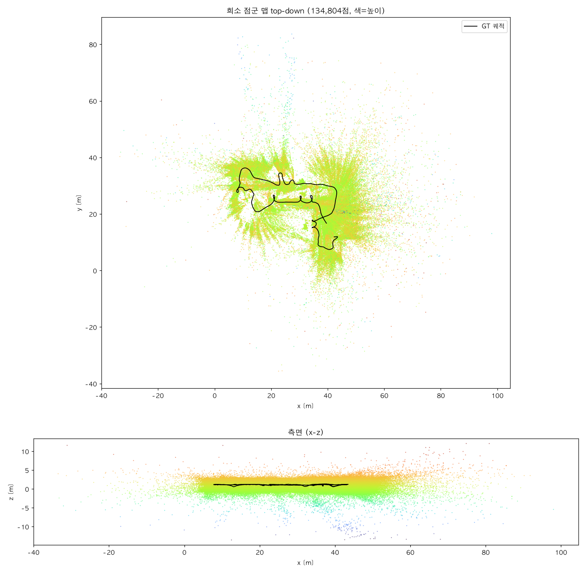
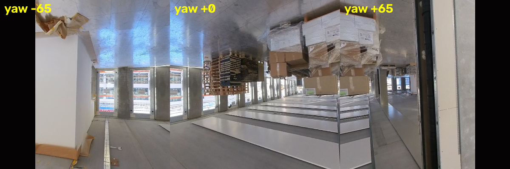

# CPU Visual Relocalization

정확한 포즈(LiDAR SLAM 또는 GT)에 이미지를 태깅해 맵 DB를 만들고,
쿼리 이미지 한 장으로 **CPU만으로 6DOF 위치를 반환**하는 파이프라인.

> 철학: *정확한 기하는 외부(LiDAR/GT)에서, 카메라는 인식용으로.*
> COLMAP/SFM 없이 — 포즈를 이미 아는 이미지들 사이의 삼각측량만으로 3D를 얻는다.

| 단계 | 기술 | 역할 |
|---|---|---|
| 전역 검색 | [MegaLoc](https://github.com/gmberton/MegaLoc) (폴백 CosPlace) | 쿼리와 비슷한 장소의 DB 프레임 top-k 선별 |
| 로컬 특징 | [XFeat](https://github.com/verlab/accelerated_features) + LighterGlue | CPU 친화적 특징 추출·매칭 |
| 측위 | PnP + RANSAC + VVS refine | 2D-3D 대응 → 6DOF 포즈 |

전 단계 CPU 전용 — MegaLoc 임베딩 0.09초/장, 쿼리 1장 측위 ~1초 (Apple Silicon 기준).

## 결과 (Hilti-Trimble SLAM Challenge 2026, floor_2)

### 같은 run 내 held-out 평가 (run1 맵 ← run1 중간 프레임 쿼리)

**성공률 94.1% (289/307), 중앙값 위치오차 1.6cm** — 기준: <0.25m & <5°



### 크로스-run 평가 (run1 맵 ← run2 쿼리, 다른 주행)

원점수는 3.5%로 보이지만 분해하면 시스템 밖 요인이 대부분이다:

| 요인 | 값 |
|---|---|
| 맵 커버리지 밖 쿼리 (60개) | 대부분 거절 — "모르는 곳"에 None 반환이 정답 |
| run1/run2 GT 등록 어긋남 | 회전 ~0.2°, 평행이동 ~0.21m (시스템 밖 요인) |
| **GT 정렬 후 실질 성능** | **성공 ~73%, 중앙값 11.3cm** (커버 영역 내 추정 반환분) |

남은 실패의 지배 요인은 핸드헬드 촬영 특성이다 — 보행자가 바닥·천장을
보는 순간, 자기 다리·빈 벽 클로즈업 등 어떤 시스템도 측위할 수 없는
쿼리가 다수. 수평 고정 카메라(로봇) 배치에서는 발생하지 않는 조건.



run2 쿼리(초록=성공, 빨강=None)가 run1 궤적(회색) 위에서만 성공하는 것이
보인다 — 맵이 아는 곳은 찾고, 모르는 곳은 정직하게 거절한다.
남은 None의 상당수는 보행자 자신의 다리·바닥 클로즈업 등 측위 불가능 쿼리.

### 매칭 품질

| 복도 (같은 run) | 어두운 설비실 (크로스-run) |
|---|---|
|  |  |

왼쪽=쿼리, 오른쪽=DB 후보, 초록 선=PnP 인라이어. 저조도에서도 인라이어 75개.

## 핵심 설계

### 1. GT 포즈 삼각측량으로 3D 태깅 (LiDAR 없이)

배포 bag에 LiDAR가 없어, 포즈를 아는 두 시점의 매칭점을 광선 교차로 3D화한다.
GT가 LiDAR 기반이라 스케일은 metric. 게이트(베이스라인/재투영/깊이비율)로
불량 3D를 걸러 PnP 오염을 막는다.

- **다중 쌍 + 일관성 병합**: 이웃 4쌍(i±1, i±2)에서 각각 삼각측량,
  추정끼리 불일치하면 기각 → 잘못된 매칭이 3D로 굳는 것 방지
- **깊이 비율 게이트**: 깊이 오차 ∝ depth²/baseline 이므로 절대 깊이 대신
  `depth < 50 × baseline` — 도보(15m)·차량(150m) 실내외 겸용



### 2. 200° 어안 → 다중 핀홀 뷰

어안 전체는 핀홀로 펼 수 없다. 중앙만 쓰면 시야 손실이 커서,
yaw −65°/0°/+65° 세 가상 뷰로 펴고 각 뷰를 독립 카메라(포즈 = 카메라 포즈 ×
뷰 회전)로 취급한다. 전/후방 카메라 × 3뷰 = 어안 2장이 6개 핀홀 시퀀스가 된다.



### 3. 후보별 개별 PnP

top-k 후보의 대응을 한 번에 합치면 비슷하게 생긴 다른 장소(alias)가 RANSAC을
오염시킨다 (실제로 4m 오정합 발생). 후보마다 PnP를 따로 풀고 인라이어 최다
결과를 채택 — alias는 인라이어 경쟁에서 자연 탈락한다.

### 4. 가이드 재매칭 (2단계 PnP)

1차 PnP로 대략적 포즈가 나오면, top-k 후보 전체의 3D점을 쿼리에 투영해
"보여야 할 위치" 반경 내에서 디스크립터 재대응 → 2차 PnP.
실측 인라이어 75 → 131. 경로에서 벗어난 쿼리일수록 이득이 크다.

### 5. 정직한 실패

인라이어가 기준 미달이면 틀린 포즈 대신 None을 반환한다. 크로스-run에서
맵 밖 쿼리 대부분을 거절한 것이 이 설계의 검증이다.

## 사용 (API)

맵(DB)은 카메라 독립적 — 월드 3D점+디스크립터만 저장하므로, 맵을 만든
카메라(어안)와 위치를 묻는 카메라(임의 핀홀)가 달라도 된다.

```python
# Python API — 모델·DB 1회 로드 후 재사용 (쿼리당 ~0.6초, CPU)
from src.reloc import Relocalizer
r = Relocalizer('config.yaml')
res = r.localize('photo.jpg')                    # 데이터셋 어안 (config 캘리브)
res = r.localize(img_bgr, K=K_3x3, dist=[...])   # 임의 핀홀 + 클라이언트 캘리브
# 성공: {'ok': True, 'xyz': [...], 'quat': [...], 'inliers': N}
# 실패: {'ok': False, 'reason': ...}  ← 틀린 포즈를 반환하지 않는다
```

```bash
# CLI
.venv/bin/python -m src.reloc photo.png

# HTTP 서버
.venv/bin/uvicorn src.server:app --host 0.0.0.0 --port 8000
curl -F "image=@photo.jpg" http://localhost:8000/localize
curl -F "image=@photo.jpg" \
     -F "intrinsics=615.0,615.0,320.0,240.0" \
     -F "dist=0.1,-0.2,0,0,0" \
     http://localhost:8000/localize             # 클라이언트 캘리브 동봉
```

## 실행

```bash
python3.11 -m venv .venv && .venv/bin/pip install -r requirements.txt

# 1. DB 구축 (오프라인 1회)
.venv/bin/python -m src.build_db config.yaml

# 2. 평가 — 같은 run held-out
.venv/bin/python -m src.eval config.yaml

#    크로스-run (다른 주행의 bag/GT로)
.venv/bin/python -m src.eval config.yaml --query-bag <bag폴더> --query-gt <TUM파일>

# 3. 분석 도구
.venv/bin/python tools/crossrun_report.py            # 커버리지·GT정렬 공정 채점
.venv/bin/python tools/visualize_eval.py             # 궤적 위 결과 플롯
.venv/bin/python tools/match_gallery.py --n 6        # 매칭 갤러리 (성공/실패/None)
.venv/bin/python tools/show_matches.py <쿼리.png>    # 쿼리 1장 top-k 상세
.venv/bin/python tools/export_ply.py                 # 희소 점군 PLY
```

데이터: [Hilti-Trimble SLAM Challenge 2026](https://github.com/Hilti-Research/hilti-trimble-slam-challenge-2026)
bag(ROS2)을 `data/`에 두고 `config.yaml`의 경로·캘리브를 맞춘다.
ROS 설치 불필요 — Jazzy bag은 sqlite 직접 리더([src/bag2.py](src/bag2.py))로 읽는다.

## 구조

```
src/
  bag2.py           ROS2 bag 직접 리더 (rosbags 타입해시 우회)
  extract.py        bag → 이미지 추출 (ROS1/ROS2)
  rectify.py        어안(equidistant) → 핀홀 다중 뷰
  pose_provider.py  TUM 궤적 보간 (GT ↔ SLAM 세션 공용 인터페이스)
  triangulate.py    두-뷰 삼각측량 + 다중 뷰 일관성 병합
  features.py       XFeat 추출/매칭
  retrieval.py      MegaLoc/CosPlace 전역 검색
  pnp.py            PnP+RANSAC+VVS
  build_db.py       DB 구축 파이프라인
  localize.py       쿼리 1장 → 6DOF (후보별 PnP + 가이드 재매칭)
  reloc.py          사용자 API (Relocalizer) + CLI
  server.py         FastAPI HTTP 서버 (/localize, /health)
  eval.py           held-out / 크로스-run 평가 (쿼리 다중 뷰)
tests/              단위 테스트 (합성 데이터 기반, 20개)
tools/              진단·시각화 도구
```

## 로드맵

- [x] M1-M3: bag 리더 · 삼각측량 3D 태깅 · 모델 래퍼
- [x] M4: held-out 평가 94.1% / 크로스-run 검증
- [x] 쿼리 측 다중 뷰 + 가이드 재매칭
- [x] 측위 API (Python / CLI / HTTP, 클라이언트 캘리브 지원)
- [x] M5: 자체 LiDAR SLAM 궤적으로 DB 구축 — GT 없이 완전 자체 파이프라인.
      Hilti 2021 exp02에서 held-out 1,716쿼리 성공률 55.5%, **중앙값 7.2cm**
      (통합 레포: [LIO_VisualReloc](https://github.com/MyungJewon/LIO_VisualReloc))
- [ ] 시각 루프클로저 제안을 SLAM 포즈그래프에 공급 (매핑 강화)
- [ ] 다중 세션 DB 병합 (시점 다양성 축적 → 경로 밖 측위 강화)
